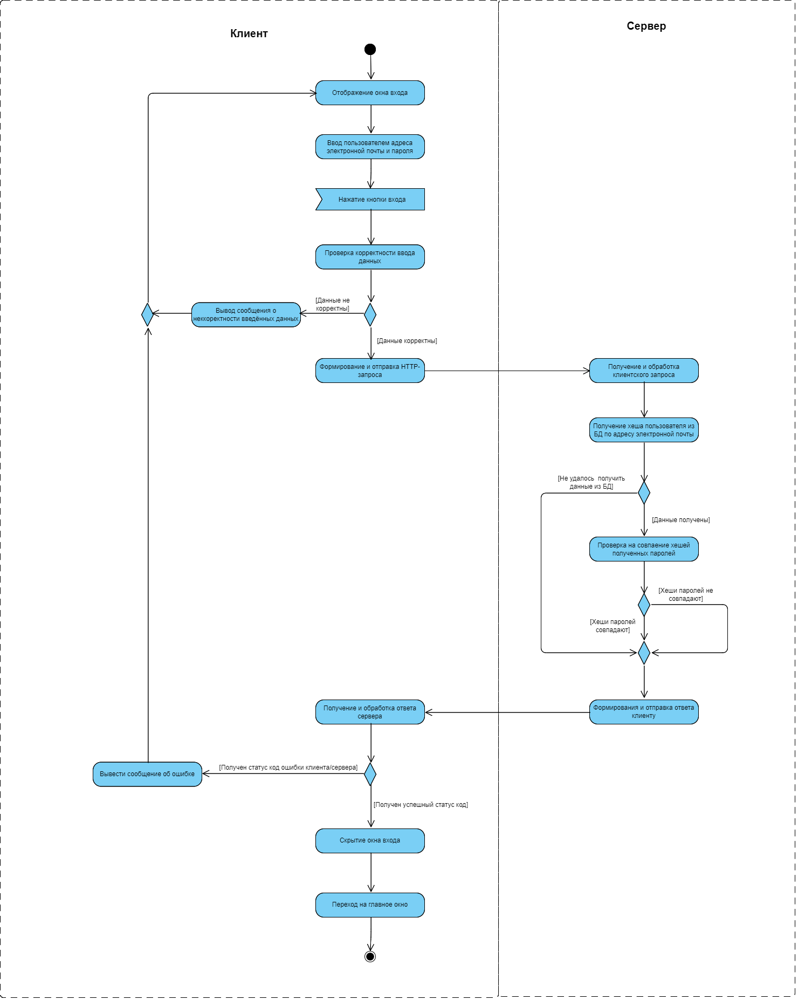
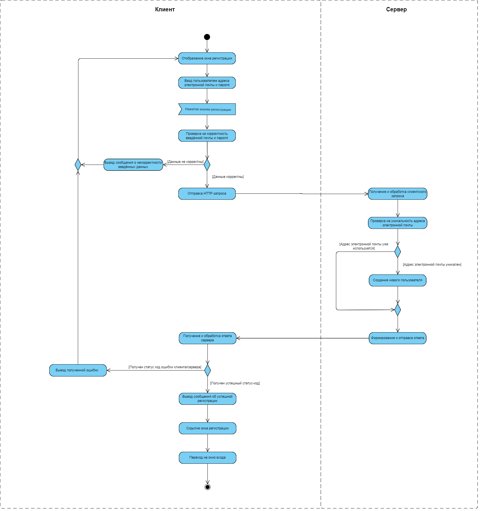
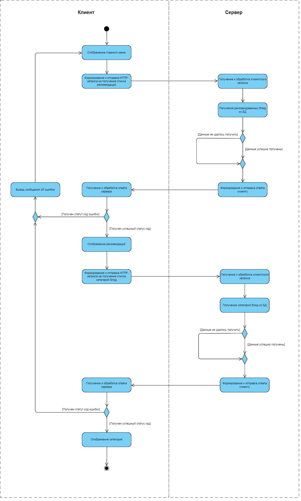

# Диаграммы активностей

## Содержание

1. [Вход в аккаунт](#login)
2. [Регистрация](#register)
3. [Просмотр главного меню](#view_menu)

---

<a name="login"/>

## 1. Вход в аккаунт

---

<a name="register"/>

## 2. Регистрация

---

<a name="view_menu"/>

## 3. Просмотр главного меню

