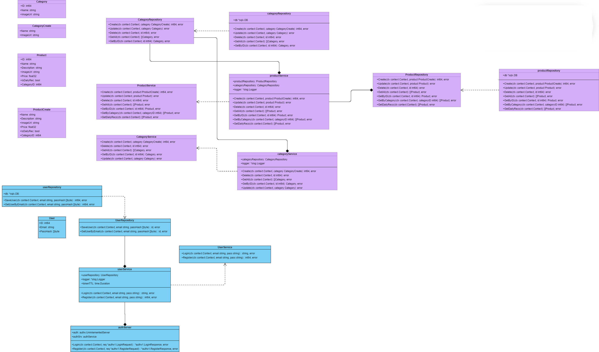

## Диаграмма классов

## Глоссарий

| Название класса      | Описание                                       |
|----------------------|------------------------------------------------|
| `User`               | Класс пользователя.                            |
| `UserRepositoty`     | Интерфейс для работы с БД пользователей.       |
| `UserService`        | Интерфейс бизнес-логики пользователей.         |
| `Product`            | Класс продукта.                                |
| `Category`           | Класс категории продукта.                      |
| `ProductRepository`  | Интерфейс для работы с БД продуктов.           |
| `ProductService`     | Интерфейс бизнес логики продуктов.             |
| `CategoryRepository` | Интерфейс для работы С БД категорий продуктов. |
| `CategoryService`    | Интерфейс бизнес-логики категорий продуктов.   |