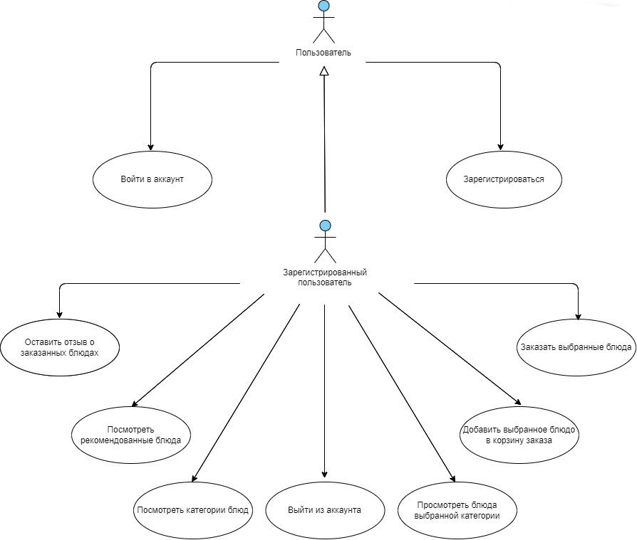

# Диаграмма вариантов использования

# Глоссарий

| Термин                            | Определение                                            |
|-----------------------------------|--------------------------------------------------------|
| `Пользователь`                    | Человек, который начал использовать приложение.        |
| `Зарегистрированный пользователь` | Пользователь, ранее зарегистрировавшийся в приложении. |

# Поток событий

# Содержание

1. [Актеры](#actors)
2. [Варианты использования](#use_case)
   - [Зарегистрироваться](#register)
   - [Войти в аккаунт](#login)
   - [Просмотр рекомендованных блюд](#view_recs)
   - [Просмотр категорий блюд](#view_categories)
   - [Добавить выбранное блюдо в корзину](#add_to_cart)
   - [Просмотр блюд выбранной категории](#view_category_produсts)
   - [Оставить отзыв о заказанных блюдах](#review)
   - [Сделать заказ](#order)

<a name="actors"/>

# 1 Актёры

| Термин                            | Определение                                            |
|-----------------------------------|--------------------------------------------------------|
| `Пользователь`                    | Человек, который начал использовать приложение.        |
| `Зарегистрированный пользователь` | Пользователь, ранее зарегистрировавшийся в приложении. |

<a name="use_case"/>

# 2 Варианты использования

<a name="login"/>

## 2.1 Войти в аккаунт

**Описание.** Вариант использования "Войти в аккаунт" позволяет пользователю войти в учётную запись.  
**Предусловия.** Пользователь выбрал способ "Вход" для входа в приложение.  
**Основной поток.**
1. Приложение отображает окно входа в аккаунт;
2. Пользователь вводит данные;
3. Пользователь подтверждает ввод;
4. Приложение проверяет корректность данных;
5. У пользователя октрывается окно главного меню, если данные корректны;
6. У пользователя выводится сообщение с ошибкой, если данные некорректны;
7. Вариант использования завершается.

<a name="register"/>

## 2.2 Зарегистрироваться

**Описание.** Вариант использования "Зарегистрироваться" позволяет пользователю создать свой аккаунт в приложении.  
**Предусловия.** Анонимный пользователь захотел зарегистрироваться в приложении, выбрав пункт меню "Регистрация".

**Основной поток.**
1. Приложение отображает окно регистрации, в котором запрашивает у пользователя ввод данных;
2. Пользователь вводит данные;
3. Пользователь подтверждает ввод;
4. Приложение проверяет корректность данных;
5. Если данные корректны, приложение пытается зарегистрировать данные пользователя в БД;
6. Если данные введённые пользователем уже зарегистрированы, выводится сообщение об ошибке;
7. Если данные введённые пользователем не зарегистрированы, пользователю выводится сообщение об успешной регистрации;
8. Вариант использования завершается;

<a name="view_recs"/>

## 2.3 Просмотр рекомендованных блюд

**Описание.** Вариант использования "Просмотр рекомендовынных блюд" позволяет пользователю просмотреть список рекомендаций.  
**Предусловия.** Зарегистрированный пользователь захотел посмотреть список рекомендованных блюд".

**Основной поток.**
1. После успешной авторизации пользователя, приложение отображает окно главного меню;
2. Приложение обращается к сервису рекомендаций;
3. Приложение получает данные;
4. Приложение отображает список рекомендаций, если данные корректны.
5. Приложение отображает данные об ошибке, если данные некорректны.
6. Вариант использования завершается;

<a name="view_categories"/>

## 2.4 Просмотр категорий блюд

**Описание.** Вариант использования "Просмотр категорий блюд" позволяет пользователю просмотреть список категорий блюд.  
**Предусловия.** Зарегистрированный пользователь захотел посмотреть список категорий блюд".

**Основной поток.**
1. После успешной авторизации пользователя, приложение отображает окно главного меню;
2. Приложение обращается к БД продуктов и возвращает все категории;
3. Приложение получает данные;
4. Приложение отображает список категорий продуктов, если данные корректны.
5. Приложение отображает данные об ошибке, если данные некорректны.
6. Вариант использования завершается;

<a name="add_to_cart"/>

## 2.5 Добавить выбранное блюдо в корзину

**Описание.** Вариант использования "Добавить выбранное блюдо в корзину" позволяет пользователю просмотреть список категорий блюд.  
**Предусловия.** Зарегистрированный пользователь захотел добавить понравившееся ему блюдо в корзину".

**Основной поток.**
1. После успешной авторизации пользователя, приложение отображает окно главного меню;
2. Пользователь нажимает на кнопку добавление блюда в корзину;
3. Приложение обращается к сервису корзины;
4. Сервис корзины обращается к сервису продуктов для проверки, что блюдо существует;
5. Сервис продуктов отправляет ответ сервису корзины;
6. Сервис корзины добавляет блюдо в корзину пользователя, если получен успешный статус код;
7. Сервис корзины не добавляет блюдо в корзину пользователя, если получен статус код ошибки;
8. Сервис корзины отправляет ответ приложению;
9. Приложение сообщает об успешном добавлении блюда в корзину, если ответ успешный;
10. Приложение сообщает об ошибке, если ответ содрежит статус код ошибки;
11. Вариант использования завершается;

<a name="view_category_produсts"/>

## 2.6 Просмотр блюд выбранной категории

**Описание.** Вариант использования "Просмотр блюд выбранной категории" позволяет пользователю просмотреть список блюд выбранной категории.  
**Предусловия.** Зарегистрированный пользователь захотел посмотреть список блюд выбранной им категории".

**Основной поток.**
1. После успешной авторизации пользователя, приложение отображает окно главного меню;
2. Пользователь нажимает на иконку выбранной им категории;
3. Приложение обращается к сервису продуктов, для получения продуктов выбранной им категории;
4. Сервис продуктов получает данные, формирует ответ и отправляет его;
5. Приложение отображает окно просмотра блюд, которое содержит блюда, выбранной пользователем категории, если ответ успешный;
6. Приложение сообщает об ошибке, если получен статус код ошибки;
7. Вариант использования завершается;

<a name="review"/>

## 2.7 Оставить отзыв о заказанных блюдах

**Описание.** Вариант использования "Оставить отзыв о заказанных блюдах" позволяет пользователю оставить отзыв о заказе.  
**Предусловия.** Зарегистрированный пользователь захотел добавить отзыв о заказе".

**Основной поток.**
1. После оплаты или получения заказа, приложение предлагает оставить отзыв о заказе;
2. Пользователь заполняет отзыв и нажимает на кнопку "Оставить отзыв";
3. Приложение обращается к сервису отзывов;
4. Сервис отзывов сохраняет отзыв пользователя;
5. Сервис отзывов отправляет ответ приложению;
6. Приложение сообщает об успешной операции и отображает отзыв пользователя в списке всех отзыввов, если ответ успешен;
7. Приложение сообщает об ошибке, если получен статус код ошибки;
8. Вариант использования завершается;

<a name="order"/>

## 2.7 Сделать заказ

**Описание.** Вариант использования "Сделать заказ" позволяет пользователю сделать заказ.
**Предусловия.** Зарегистрированный пользователь захотел заказать понравившееся ему блюда".

**Основной поток.**
1. Пользователь нажимает на кнопку сделать заказ;
2. Пользователь вводит необходимые данные и нажимает кнопку подтвердить;
3. Приложение обращается к сервису заказов;
4. Сервис заказов сохраняет заказ пользователя и отправляет ответ приложению;
5. Приложение переносит пользователя в окно сделанных им заказов, если статус код успешен.
6. Приложение сообщает об ошибке, если ответ содержит статус код ошибки.
7. Вариант использования завершается;

