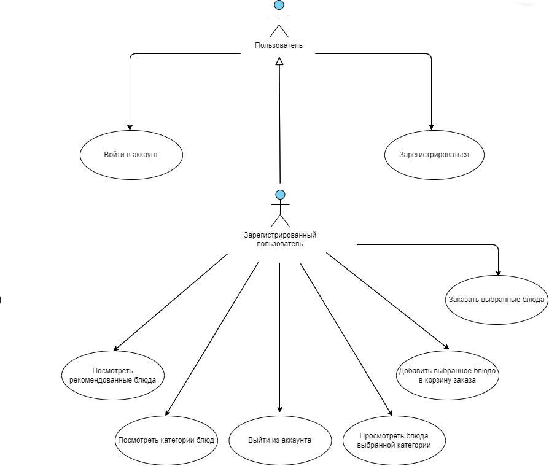

# Диаграмма вариантов использования

## Глоссарий

| Термин                            | Определение                                            |
|-----------------------------------|--------------------------------------------------------|
| `Пользователь`                    | Человек, который начал использовать приложение.        |
| `Зарегистрированный пользователь` | Пользователь, ранее зарегистрировавшийся в приложении. |

## Поток событий

## Содержание

1. [Актеры](#actors)
2. [Варианты использования](#use_case)
2.1 [Зарегистрироваться](#register)
2.2 [Войти в аккаунт](#login)
2.3 [Просмотреть рекомендованные блюда](#view_recs)
2.4 [Просмотреть категории блюд](#view_categories)
2.5 [Добавление выбранного блюда в корзину](#add_to_cart)
2.6 [Просмотр блюд выбранной категории](#view_category_produtcs)
2.7 [Оставить отзыв о заказанных блюдах](#review)
2.8 [Сделать заказ](#order)

<a name="actors"/>

# 1 Актёры

| Термин                            | Определение                                            |
|-----------------------------------|--------------------------------------------------------|
| `Пользователь`                    | Человек, который начал использовать приложение.        |
| `Зарегистрированный пользователь` | Пользователь, ранее зарегистрировавшийся в приложении. |

<a name="use_case"/>

# 2 Варианты использования

<a name="login"/>

## 2.1 Войти в аккаунт

**Описание.** Вариант использования "Войти в аккаунт" позволяет пользователю войти в учётную запись.  
**Предусловия.** Пользователь выбрал способ "Вход" для входа в приложение.  
**Основной поток.**
1. Приложение отображает окно входа в аккаунт;
2. Пользователь вводит данные;
3. Пользователь подтверждает ввод;
4. Приложение проверяет корректность данных;
5. У пользователя октрывается окно главного меню, если данные корректны;
6. У пользователя выводится сообщение с ошибкой, если данные некорректны;
7. Вариант использования завершается.

<a name="register"/>

## 2.2 Зарегистрироваться

**Описание.** Вариант использования "Зарегистрироваться" позволяет пользователю создать свой аккаунт в приложении.  
**Предусловия.** Анонимный пользователь захотел зарегистрироваться в приложении, выбрав пункт меню "Регистрация".  
**Основной поток.**
1. Приложение отображает окно регистрации, в котором запрашивает у пользователя ввод данных;
2. Пользователь вводит данные;
3. Пользователь подтверждает ввод;
4. Приложение проверяет корректность данных;
5. Если данные корректны, приложение пытается зарегистрировать данные пользователя в БД;
6. Если данные введённые пользователем уже зарегистрированы, выводится сообщение об ошибке;
7. Если данные введённые пользователем не зарегистрированы, пользователю выводится сообщение об успешной регистрации;
8. Вариант использования завершается;   |