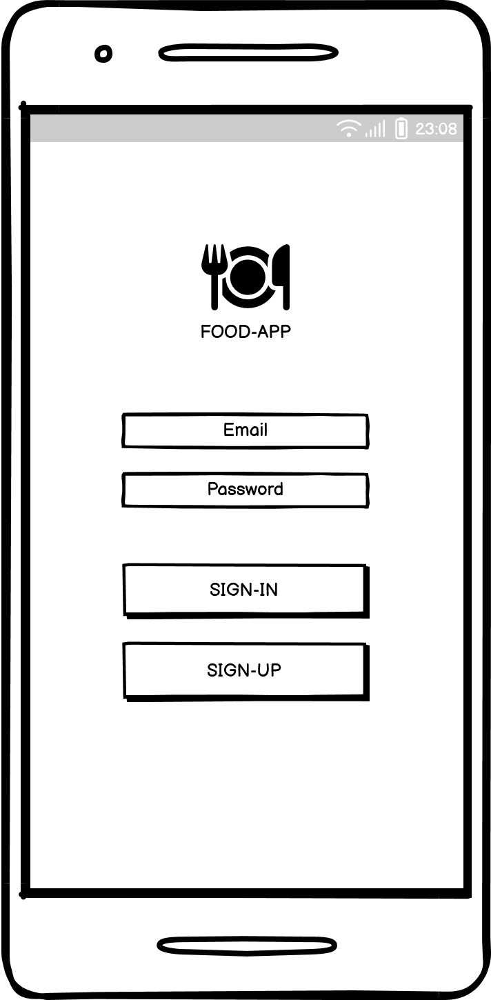
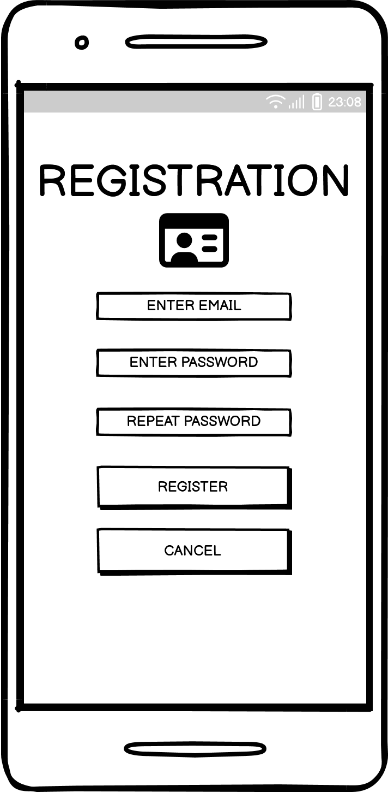
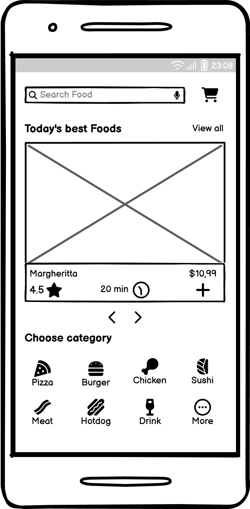
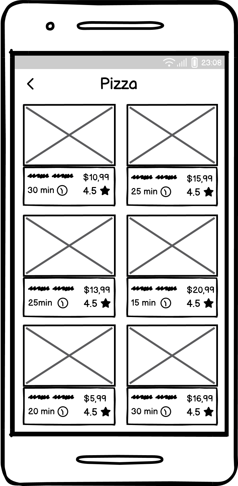
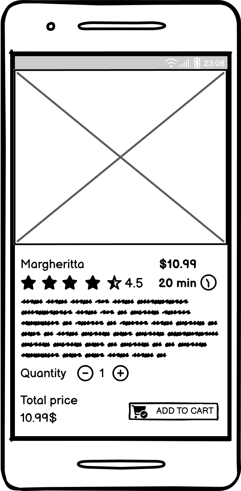
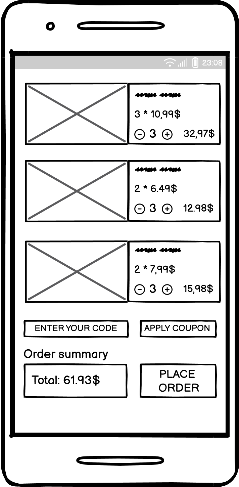

# Требования к проекту

## 1. Введение

### Название продукта
**BISTRO FOOD** — это мобильное для онлайн-заказа еды из ресторана. Приложение позволяет пользователям просматривать меню, добавлять блюда в корзину и оформлять заказы.

### Границы проекта
**BISTRO FOOD** будет предоставлять следующие функции:
- Просмотр меню и информации о блюдах
- Оформление заказов и управление корзиной
- Регистрация и аутентификация пользователей

**Приложение не будет**:
- Обеспечивать функционал для управления рестораном (например, управление запасами)
- Отображать информацию о курьере с заказом в реальном времени.

## 2. Требования пользователя

### 2.1 Программные интерфейсы
Приложение будет взаимодействовать со следующими внешними системами и библиотеками:
- **gRPC**: для взаимодействия между микросервисами
- **PostgreSQL**: как основная база данных для хранения информации о пользователях, заказах и меню
- **JWT**: для аутентификации и авторизации пользователей

### 2.2 Интерфейс пользователя
Система будет взаимодействовать с пользователем через:
- **Графический интерфейс** (мобильное приложение), который будет включать:
    - Экран для просмотра меню
    - Корзина для управления выбранными блюдами
    - Экран для оформления заказа
    - Экран аунтетификации и регистрации

1. **Аутентификация**  
   

2. **Регистрация**  
     

3. **Главное меню**  
     

4. **Список продуктов для категории**  
     

5. **Информация о выбранном товаре**  
   

6. **Список добавленных товаров**  
   

### 2.3 Характеристики пользователей
**Целевая аудитория**:
1. **Клиенты**: пользователи, желающие заказать еду.
    - Уровень образования: различный (от школьного до высшего)
    - Опыт: от новичков до опытных пользователей мобильных приложений

### 2.4 Предположения и зависимости
- Доступность интернет-соединения для пользователей.
- Поддержка современных мобильных устройств и браузеров.
- Зависимость от работы внешних сервисов (например, платежные системы).

## 3. Системные требования

### 3.1 Функциональные требования
1. Пользователь должен иметь возможность просматривать меню ресторана.
2. Пользователь должен иметь возможность добавлять блюда в корзину.
3. Пользователь должен иметь возможность оформлять заказ.
4. Система должна обеспечивать регистрацию и аутентификацию пользователей.

### 3.2 Нефункциональные требования

#### 3.2.1 Атрибуты качества
- **Безопасность**: Все данные пользователей должны быть защищены с помощью шифрования и аутентификации.
- **Удобство использования**: Интерфейс должен быть интуитивно понятным для всех групп пользователей. Удобство использования будет оцениваться через пользовательское тестирование и опросы.
